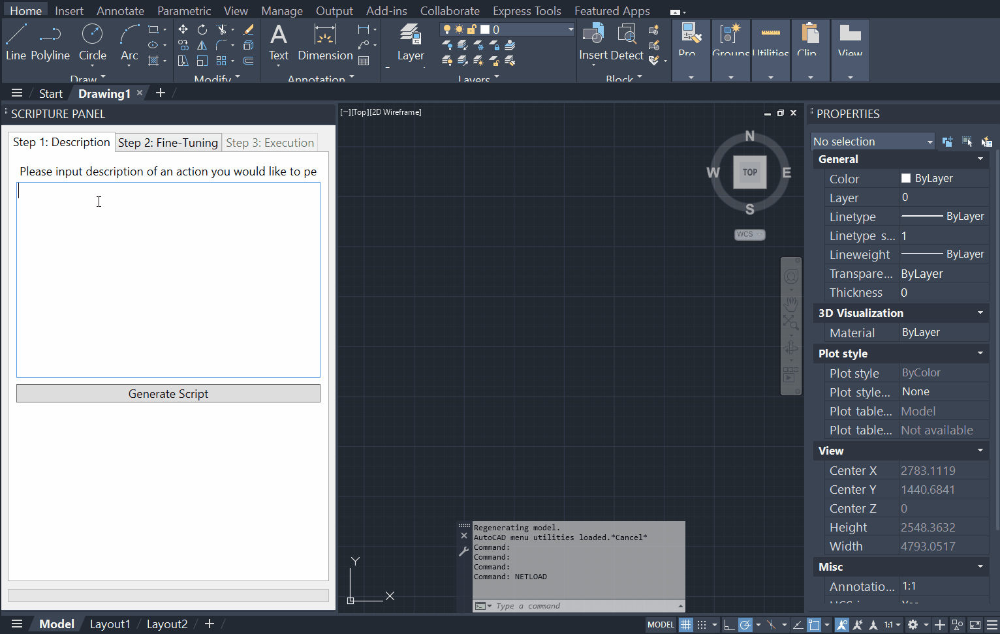
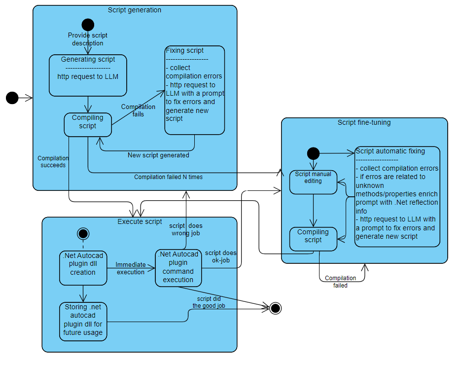

# SCRIPTURE - LLM-Based Automation Plugin for AutoCAD

SCRIPTURE is a powerful automation tool for AutoCAD that allows users to automate their workflows by simply describing the actions to be automated with text. 

This tool is currently a prototype and is designed for research and experimentation.

## Example




## Prerequisites

- **AutoCAD** (or similar): Make sure AutoCAD or similar application supporting running .net8 objectARX plugins is installed on your machine
- **Access to an LLM**: Requires an API key and endpoint for either:
  - **Microsoft Azure OpenAI API**
  - **OpenAI API** (not tested yet)

## How to Try It

### Install or Compile

You have two options to get started with SCRIPTURE:

1. **Compile Locally**  
   Clone the repository and build the solution locally using dotnet tool.

2. **Install via MSI or Bundle**
   
   - **MSI Installer**: Use the MSI installer to install the plugin. You need to ensure .NET 8 runtime is already installed.
   - **Bundle Installer**: Use the bundle (`bundle.exe`) to install both the .NET 8 runtime (if not installed) and the plugin.

Please use next link: https://github.com/dimitrovakulenko/Scripture/releases to download an installer.

### Configure `appSettings.json`

You can find 'appSettings.json'  file in `C:\Program Files\Scripture Plugin\` (%PROGRAMFILES%) folder in case of using installer and in the bin folder of scripture project in case of local build.
To use SCRIPTURE, you need to configure the `appSettings.json` file.

- **Azure OpenAI API Configuration**:
  
  ```json
  {
    "InitialScriptModel": {
      "ApiKey": "YOUR_AZURE_OPENAI_API_KEY",
      "Endpoint": "https://YOUR_AZURE_ENDPOINT.openai.azure.com/",
      "ModelName": "YOUR_MODEL_DEPLOYMENT_NAME"
    }
  }
  ```
  
  - Set ApiKey to your Azure OpenAI API key.
  - Set Endpoint to your Azure OpenAI resource endpoint URL.
  - Set ModelName to your Azure deployment name.

- **OpenAI API Configuration**:
  
  ```json
  {
    "InitialScriptModel": {
      "ApiKey": "YOUR_OPENAI_API_KEY",
      "Endpoint": "",
      "ModelName": "CHOSEN_MODEL_NAME"
    }
  }
  ```
  
  - Set ApiKey to your OpenAI API key.
  - Set ModelName to the desired model (e.g., gpt-4o).
  - Keep Endpoint empty.

### Running the Plugin in AutoCAD

After installation or compilation, you can run the plugin in AutoCAD:

- In AutoCAD, use the command `NETLOAD`
- Select `scripture.dll` file from the plugin folder (`C:\Program Files\Scripture Plugin\` in case of full install, binaries folder in case of local build)

### Using the Plugin

Once the plugin is loaded in AutoCAD, you can use it as follows:

**Step 1: Enter a Prompt and Generate Script**
   
   Start by entering a prompt that describes the action you want to automate, and click the "Generate Script" button. If the LLM (Language Model) successfully generates the script, you will be automatically navigated to Step 3.

**Step 3: Execute or Save as Plugin**
   
   At this stage, you can either execute the script immediately or save it as a separate DLL/plugin for future use. If you choose to save the script, it will be compiled into a custom command dll that can be used in AutoCAD anytime by loading the DLL with the `NETLOAD` command and executing corresponding command.

**Step 2: Fix Script Errors (Optional)**
   
   If script generation fails or produces errors, you will be taken to Step 2. 
   
   Here, you can attempt to fix the script automatically by clicking "Try Fix" or manually edit the script using the AvalonEdit control. 
   
   Once you've made changes, click "Recompile Script" to verify if the errors are resolved.

### Software Architecture: Concepts

- Initial script generation: ask LLM to generate script by description, try compile script, if there are errors ask LLM to fix the errors maximum N times
- Automatic fixing / fine-tuning: provide additional content to LLM when it tries to fix compilation errors, an additional content can be all existing properties and methods of a specific class to avoid hallucinations/unexisting methods creation



### Software Architecture: Technical

**The solution**

Consists of next projects:
- ScriptureCore: contains all core services required by the plugin: script generation service (communication to LLM), script commpilation service (Roslyn API).
- ScriptureCore.Tests: contains tests for the core services
- ScriptureUI: a simple WPF control to host the UI; a proper viewmodel tbd;
- ScriptureHarnessApp: enabled testing fo the UI control without running the complete plugin from Autocad
- Scripture: Autocad .Net plugin, depends on ObjectARX.Net API

**Installer**

Installer implemented using Wix 3.1x.
Scripture.Installer project results in plugin msi installer.
Scripture.Bundle.Installer project results in exe file that install plugin and .Net runtime.

**CI & Release Builds**

Implemented as github actions

### License

This project is licensed under the MIT License - see the [LICENSE](LICENSE) file for details.
